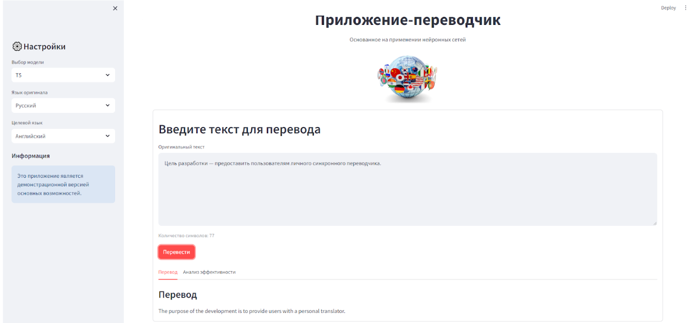

# GUI для моделей-переводчиков
Часть проекта, отвечающая за GUI приложения для взаимодействия с пользователем.


## Project Structure:
```
GUI
├── config
│   ├── __init__.py
│   └── config.py                  # конфигурации для запуска моделей
├── images                         # папка под изображения
│   └── translator.png             
├── src
│   ├── api
│   │   ├── __init__.py
│   │   └── model_integration.py   # обработка запросов к моделям
│   ├── utils
│   │   ├── __init__.py
│   │   └── prompt_templates.py    # промпты для моделей
│   ├── __init__.py
│   └── app.py                     # основная логика Streamlit приложения 
├── .env                           # файл с переменными окружения
├── main.py                        # файл для запуска графического приложения
└── README.md                      # файл, содержащий основную информацию о проекте
```


## Setup:
Перед запуском рекомендуется проверить файл конфигурации `GUI/config/config.py` и `.env`.

Запуск GUI из одноимённой папки:
```bash
streamlit run main.py
```


## Examples:
