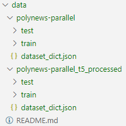

Из-за большого размера файлов в этой папке ([polynews-parallel](https://huggingface.co/datasets/aiana94/polynews-parallel),  polynews-parallel_t5_processed), её нельзя выложить на git, однако общий вид у неё следующий:

При желании можно воспроизвести эксперименты и получить такую же структуру файлов.